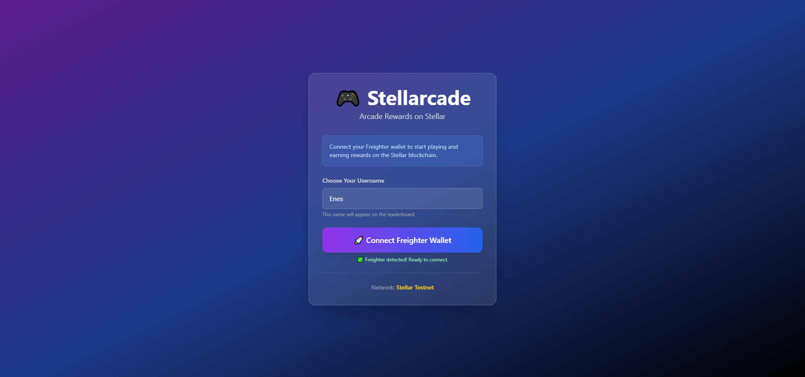

# 🎮 Stellarcade - Blockchain Arcade Games Platform



A decentralized arcade gaming platform built with Next.js, TypeScript, Tailwind CSS, and Stellar Soroban smart contracts. Play classic arcade games and compete on blockchain-powered leaderboards!

## 🎯 Features

### 🎮 **Three Classic Games**
- **🐍 Snake** - Classic snake game (10 points per food)
- **🏓 Pong** - Play against AI (10 points per paddle hit, displayed as ×10)
- **🧱 Tetris** - Stack and clear lines (progressive difficulty)

### 🔗 **Blockchain Integration**
- ✅ Freighter Wallet connection
- ✅ Username-based player profiles
- ✅ Game-specific leaderboards (separate for each game)
- ✅ Top 10 rankings stored on Stellar blockchain
- ✅ Reward claiming system for #1 players
- ✅ Double-claim prevention

### 🏆 **Leaderboard System**
- Independent leaderboards for Snake, Pong, and Tetris
- Top 10 scores per game
- Medal indicators (🥇🥈🥉) for top 3
- Current user highlighting
- Real-time score submission

## 📁 Project Structure

```
Stellarcade/
├── contract/              # Soroban smart contract (Rust)
│   ├── src/
│   │   └── lib.rs        # Game-specific leaderboard contract
│   ├── Cargo.toml
│   └── README.md
├── pages/                 # Next.js pages
│   ├── _app.tsx          # App wrapper
│   ├── index.tsx         # Username + Wallet connect
│   ├── home.tsx          # Game selection hub
│   ├── snake.tsx         # Snake game
│   ├── pong.tsx          # Pong game
│   └── tetris.tsx        # Tetris game
├── components/
│   └── Leaderboard.tsx   # Reusable leaderboard component
├── utils/
│   └── stellar.ts        # Stellar SDK + Soroban integration
├── types/
│   ├── freighter.d.ts    # Freighter API types
│   └── contract.ts       # Contract types
├── styles/
│   └── globals.css       # Tailwind CSS
└── package.json
```

## 🛠️ Setup Instructions

### Prerequisites
- Node.js 18+ and npm
- Rust and Cargo
- Stellar CLI (`stellar-cli`)
- Freighter Wallet browser extension

### 1. Install Dependencies

```powershell
npm install
```

### 2. Build the Smart Contract

Navigate to the contract directory and build:

```powershell
cd contract
cargo build --target wasm32-unknown-unknown --release
```

### 3. Deploy to Testnet

Deploy the contract using Stellar CLI:

```powershell
cd contract
stellar contract deploy --wasm target\wasm32-unknown-unknown\release\arcade_reward.wasm --source alice --network testnet
```

This will return a contract ID like: `CBAPPJI3RDC2EVGSBAY6PR77DSPY5X6OOS4RW72PPYLG5RREOWMMOUSB`

### 4. Configure Environment

Create `.env.local` file in the root directory:

```bash
NEXT_PUBLIC_CONTRACT_ID=YOUR_CONTRACT_ID_HERE
```

Replace `YOUR_CONTRACT_ID_HERE` with the contract ID from step 3.

### 5. Run Development Server

```powershell
npm run dev
```

Open [http://localhost:3001](http://localhost:3001) in your browser.

## 🎮 How to Play

### Getting Started
1. **Install Freighter**: Download from [freighter.app](https://www.freighter.app/)
2. **Enter Username**: Choose your player name
3. **Connect Wallet**: Connect your Freighter wallet
4. **Select Game**: Choose from Snake, Pong, or Tetris
5. **Play & Submit**: Beat your high score and submit to blockchain

### Game Controls

#### 🐍 Snake
- **Arrow Keys** or **WASD**: Change direction
- **Space**: Pause/Resume
- Score: 10 points per food eaten

#### 🏓 Pong  
- **Arrow Keys** or **A/D**: Move paddle left/right
- **Space**: Start game
- Score: 10 points per successful ball deflection (displayed ×10)
- AI opponent with perfect tracking

#### 🧱 Tetris
- **Arrow Keys** or **WASD**: Move and rotate pieces
- **Space**: Hard drop
- **P**: Pause/Resume
- Scoring: 40/100/300/1200 points for 1/2/3/4 lines (×level)

## 📝 Smart Contract Functions

### `submit_score(player: Address, username: String, score: u32, game: Symbol)`
Submits a score for a specific game. Updates the game's top 10 leaderboard.

### `get_leaderboard(game: Symbol) -> Vec<PlayerScore>`
Returns the top 10 scores for the specified game.

### `get_top_score(game: Symbol) -> Option<PlayerScore>`
Returns the #1 player for the specified game.

### `claim_reward(player: Address, game: Symbol) -> bool`
Allows the top player to claim their reward for a specific game.

### `has_claimed_reward(game: Symbol) -> bool`
Checks if the current #1 player has claimed their reward.

### `get_last_player(game: Symbol) -> Option<Address>`
Returns the last player who submitted a score for a game.

## 🌐 Network Information

- **Network**: Stellar Testnet
- **Horizon URL**: https://horizon-testnet.stellar.org
- **Soroban RPC**: https://soroban-testnet.stellar.org
- **Current Contract**: `CBAPPJI3RDC2EVGSBAY6PR77DSPY5X6OOS4RW72PPYLG5RREOWMMOUSB`

## 🧪 Testing the Contract

Run contract tests:

```powershell
cd contract
cargo test
```

Tests include:
- Score submission and leaderboard updates
- Separate game leaderboards
- Reward claiming
- Double-claim prevention

## 🎨 Tech Stack

### Frontend
- **Next.js 14** - React framework
- **TypeScript** - Type safety
- **Tailwind CSS** - Styling
- **Canvas API** - Game rendering

### Blockchain
- **Stellar Soroban** - Smart contracts
- **Stellar SDK** - Blockchain interaction
- **Freighter API** - Wallet integration

### Smart Contract
- **Rust** - Contract language
- **Soroban SDK 21.0.0** - Contract framework

## 🔒 Security Features

- Username validation and wallet verification
- Prevents double score submission
- Prevents double reward claiming
- Top player changes reset claim status
- Client-side high score persistence

## � Future Enhancements

- [ ] Prize pool funding (10 XLM testnet rewards)
- [ ] Daily/weekly leaderboards
- [ ] NFT achievements
- [ ] Multiplayer modes
- [ ] More games (Space Invaders, Breakout, etc.)

## 📊 Game Statistics Storage

Each game stores:
- Player address
- Username
- Score
- Timestamp (implicit in blockchain)

Storage is separated by game type using Soroban's Symbol type.

## 🐛 Known Issues

- None currently reported! 🎉

## 🤝 Contributing

1. Fork the repository
2. Create a feature branch
3. Commit your changes
4. Push to the branch
5. Open a Pull Request

## 📄 License

This project is open source and available under the MIT License.

## 🙏 Acknowledgments

- Stellar Development Foundation for Soroban
- Freighter Wallet team
- Next.js and React communities

---

**Built with ❤️ on Stellar Blockchain**